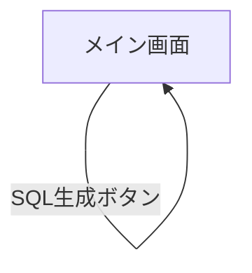

# ui.md

## 画面一覧

| 画面 | パス | 説明 |
|------|------|------|
| メイン画面 | `/` | 全機能を集約した単一ページ |

## 画面遷移図



本アプリは単一ページで完結するため、画面遷移は存在しない。

## 画面機能仕様

### メイン画面

#### レイアウト構成

```
┌─────────────────────────────────────────┐
│ ヘッダー（タイトル）                     │
├─────────────────────────────────────────┤
│ 組織情報入力フォーム                     │
│ [組織名] [都道府県コード] [市区町村コード]│
│ [利用開始日]           [利用終了日]      │
├─────────────────────────────────────────┤
│ AccountSpreadsheet                       │
│  ┌─────────────────────────────────┐    │
│  │ 教師セクション（テーブル）       │    │
│  └─────────────────────────────────┘    │
│  ┌─────────────────────────────────┐    │
│  │ 生徒セクション（テーブル）       │    │
│  └─────────────────────────────────┘    │
├─────────────────────────────────────────┤
│                        [SQL生成ボタン]   │
├─────────────────────────────────────────┤
│ [コピー] [ダウンロード]                  │
│ ┌─────────────────────────────────────┐ │
│ │ 生成された SQL・users 系（スクロール可能）│ │
│ └─────────────────────────────────────┘ │
├─────────────────────────────────────────┤
│ [コピー] [ダウンロード]                  │
│ ┌─────────────────────────────────────┐ │
│ │ 生成された SQL・member 系（スクロール可能）│ │
│ └─────────────────────────────────────┘ │
└─────────────────────────────────────────┘
```

#### 表示状態

| 状態 | 説明 |
|------|------|
| 初期表示 | 組織情報は空、スプレッドシートは教師・生徒各1行、SQL出力エリアは空 |
| 生成中 | SQL生成ボタンが無効化、ローディングスピナーを表示 |
| 生成完了 | SQL出力エリアに生成結果を表示、コピー・ダウンロードボタンが有効化 |
| エラー | エラーメッセージを表示 |

## UI 規約

| 項目 | 規約 |
|------|------|
| スタイリング | Tailwind CSS v4 のユーティリティクラスのみ使用（カスタム CSS は `globals.css` の最小限のみ） |
| カラー | 生成ボタン: green系、コピーボタン: blue系、ダウンロードボタン: gray系 |
| テーブル行 | 奇数行: 白、偶数行: ライトグレー |
| 入力フィールド | アウトライン・背景なし（テーブルセル内に溶け込む透明スタイル） |
| 無効ボタン | `disabled` 属性 + 不透明度低下で視覚的に無効状態を表示 |
| フォント | モノスペース（SQL 出力エリア） |
| レスポンシブ | 組織情報フォームは 1カラム（モバイル）→ 3カラム（デスクトップ） |
