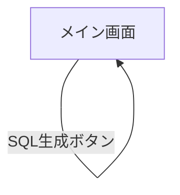

# ui.md

## 画面一覧

| 画面 | パス | 説明 |
|------|------|------|
| メイン画面 | `/` | 全機能を集約した単一ページ |

## 画面遷移図



本アプリは単一ページで完結するため、画面遷移は存在しない。

## 画面機能仕様

### メイン画面

#### レイアウト構成

```
┌─────────────────────────────────────────┐
│ ヘッダー（タイトル）                     │
├─────────────────────────────────────────┤
│ 組織情報入力フォーム                     │
│ [組織名] [都道府県コード] [市区町村コード]│
│ [利用開始日]           [利用終了日]      │
├─────────────────────────────────────────┤
│ AccountSpreadsheet                       │
│  ┌─────────────────────────────────┐    │
│  │ 教師セクション（テーブル）       │    │
│  └─────────────────────────────────┘    │
│  ┌─────────────────────────────────┐    │
│  │ 生徒セクション（テーブル）       │    │
│  └─────────────────────────────────┘    │
├─────────────────────────────────────────┤
│                        [SQL生成ボタン]   │
├─────────────────────────────────────────┤
│ [コピー] [ダウンロード]                  │
│ ┌─────────────────────────────────────┐ │
│ │ 生成された SQL・users 系（スクロール可能）│ │
│ └─────────────────────────────────────┘ │
├─────────────────────────────────────────┤
│ [コピー] [ダウンロード]                  │
│ ┌─────────────────────────────────────┐ │
│ │ 生成された SQL・member 系（スクロール可能）│ │
│ └─────────────────────────────────────┘ │
└─────────────────────────────────────────┘
```

#### 組織情報入力

| 項目 | 仕様 |
|------|------|
| 組織名 | `user_group.user_group_name` / `member.company_name` に反映される |
| 都道府県コード | デフォルト: `13` |
| 市区町村コード | デフォルト: `13101` |
| 利用開始日 | 任意入力。`member_role_periods.period_from` に反映される |
| 利用終了日 | 任意入力。`member_role_periods.period_to` に反映される |

#### アカウント入力

- 教師・生徒それぞれのアカウント一覧を表形式で入力できる
- 各行にユーザーID・ユーザー名・パスワードを入力できる
- 行を追加できる（教師: `t-N`、生徒: `s-N` のプレフィックス付き ID を自動採番）
- 行を削除できる
- 一覧を初期状態にリセットできる
- Excel / Google スプレッドシートからコピーしたタブ区切りデータをペーストで複数行展開できる
- ユーザーIDが空の行は SQL 生成時に除外される

#### SQL 生成

| 項目 | 仕様 |
|------|------|
| 生成対象 | 「SQL生成」ボタンで `users` 系・`member` 系 SQL を同時に生成する |
| パスワード | SQL 生成時に bcrypt（salt rounds: 10）でハッシュ化する。未入力時はデフォルト値 `password` をハッシュ化する |
| トランザクション | 生成 SQL は `START TRANSACTION` / `COMMIT` でラップする（ユーザー・メンバーが 0 件の場合はコメントのみ出力） |
| ロール | 教師は `role_id = 1`、生徒は `role_id = 2` で挿入する |
| メールアドレス | `{ユーザーID}@{mailDomain}` で自動生成する |

#### SQL 出力

- 生成した SQL をクリップボードにコピーできる（コピー後に「コピーしました」フィードバックを表示）
- 生成した SQL を `.sql` ファイルとしてダウンロードできる
- ダウンロードファイル名は `{組織名}_users.sql` / `{組織名}_members.sql`（組織名未入力時は `sql_export_users.sql` / `sql_export_members.sql`）
- SQL が空の場合、コピー・ダウンロードボタンは無効になる

#### 表示状態

| 状態 | 説明 |
|------|------|
| 初期表示 | 組織情報は空、スプレッドシートは教師・生徒各1行、SQL出力エリアは空 |
| 生成中 | SQL生成ボタンが無効化、ローディングスピナーを表示 |
| 生成完了 | SQL出力エリアに生成結果を表示、コピー・ダウンロードボタンが有効化 |
| エラー | エラーメッセージを表示 |

## UI 規約

| 項目 | 規約 |
|------|------|
| スタイリング | Tailwind CSS v4 のユーティリティクラスのみ使用（カスタム CSS は `globals.css` の最小限のみ） |
| カラー | 生成ボタン: green系、コピーボタン: blue系、ダウンロードボタン: gray系 |
| テーブル行 | 奇数行: 白、偶数行: ライトグレー |
| 入力フィールド | アウトライン・背景なし（テーブルセル内に溶け込む透明スタイル） |
| 無効ボタン | `disabled` 属性 + 不透明度低下で視覚的に無効状態を表示 |
| フォント | モノスペース（SQL 出力エリア） |
| レスポンシブ | 組織情報フォームは 1カラム（モバイル）→ 3カラム（デスクトップ） |
